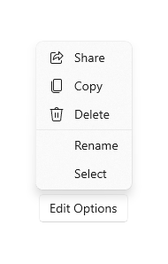
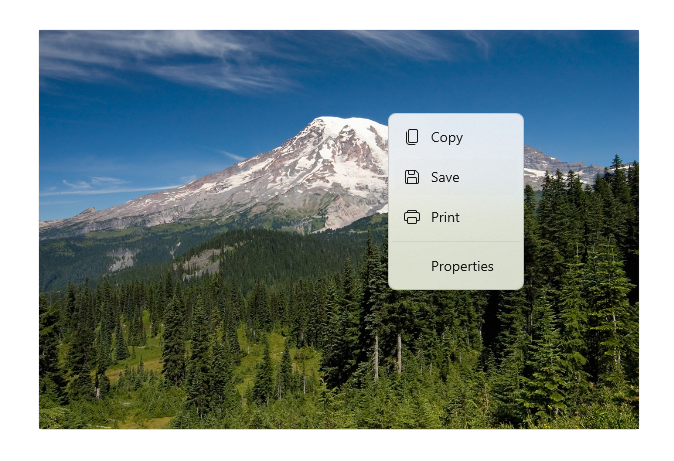

# Menus and context menus

Menus and context menus are similar in how they look and what they can contain. They both display an organized list of commands or options and save space by hiding until the user needs them. However there are differences between them, such as what you should use to create them and how they are accessed by a user.

**Get the Windows UI Library**

:::row:::
   :::column:::
      
   :::column-end:::
   :::column span="3":::
      The **MenuBar** and **CommandBarFlyout** controls are included as part of the Windows UI Library, a NuGet package that contains new controls and UI features for Windows apps. For more info, including installation instructions, see the [Windows UI Library overview](/uwp/toolkits/winui/).
   :::column-end:::
   :::column:::

   :::column-end:::
:::row-end:::

> **Windows UI Library APIs:** [CommandBarFlyout class](/uwp/api/microsoft.ui.xaml.controls.commandbarflyout), [MenuBar class](/uwp/api/microsoft.ui.xaml.controls.menubar), [TextCommandBarFlyout class](/uwp/api/microsoft.ui.xaml.controls.textcommandbarflyout)
>
> **Platform APIs:** [AppBarButton class](/uwp/api/windows.ui.xaml.controls.appbarbutton),[AppBarSeparator class](/uwp/api/windows.ui.xaml.controls.appbarseparator), [AppBarToggleButton class](/uwp/api/windows.ui.xaml.controls.appbartogglebutton), [CommandBarFlyout class](/uwp/api/windows.ui.xaml.controls.commandbarflyout),[ContextFlyout property](/uwp/api/windows.ui.xaml.uielement.contextflyout),[FlyoutBase.AttachedFlyout property](/uwp/api/windows.ui.xaml.controls.primitives.flyoutbase#xaml-attached-properties),[MenuBar class](/uwp/api/windows.ui.xaml.controls.menubar), [MenuFlyout class](/uwp/api/windows.ui.xaml.controls.menuflyout), [TextCommandBarFlyout class](/uwp/api/windows.ui.xaml.controls.textcommandbarflyout)

## Is this the right control?

Menus and context menus are for organizing commands and saving space by hiding those commands until the user needs them. To display arbitrary content, such as a notification or confirmation request, use a [dialog or a flyout](./dialogs-and-flyouts/index.md).

If a particular command will be used frequently and you have the space available, consider placing it directly in its own element so that users don't have to go through a menu to get to it.

## When should you use a menu or a context menu?

- If the host element is a button or some other command element whose primary role is to present additional commands, use a menu.
- If the host element is some other type of element that has another primary purpose (such as presenting text or an image), use a context menu.

If you want to add commands (such as Cut, Copy, and Paste) to a text or image element, use a context menu instead of a menu. In this scenario, the primary role of the text element is to present and edit text; additional commands (such as Cut, Copy, and Paste) are secondary and belong in a context menu.

## Context menus

Context menus have the following characteristics:

- Are attached to a single element and display secondary commands.
- Are invoked by right clicking (or an equivalent action, such as pressing and holding with your finger).
- Are associated with an element via its [ContextFlyout](/uwp/api/windows.ui.xaml.uielement.contextflyout) property.

In cases where your context menu will include common commands (such as Copy, Cut, Paste, Delete, Share, or text selection commands), use [command bar flyout](command-bar-flyout.md) and group these common commands together as primary commands so that they will be shown as a single, horizontal row in the context menu.

In cases where your context menu will not include common commands, either [command bar flyout](command-bar-flyout.md) or [menu flyout](menus.md) can be used to show a context menu. We recommend using CommandBarFlyout because it provides more functionality than MenuFlyout and, if desired, can achieve the same behavior and look of MenuFlyout by using only secondary commands.

## Menus

Menus have the following characteristics:

- Have a single entry point (a File menu at the top of the screen, for example) that is always displayed.
- Are usually attached to a button or a parent menu item.
- Are invoked by left-clicking (or an equivalent action, such as tapping with your finger).
- Are associated with an element via its [Flyout](/uwp/api/windows.ui.xaml.controls.button.flyout) or [FlyoutBase.AttachedFlyout](/uwp/api/windows.ui.xaml.controls.primitives.flyoutbase#xaml-attached-properties) properties, or grouped in a menu bar at the top of the app window.

When the user invokes a command element (such as a button) whose primary role is to present additional commands, use [menu flyout](menus.md) to host a single top-level menu to be shown inline as a flyout attached to the on-canvas UI element. Each MenuFlyout can host menu items and sub-menus. For apps that might need more organization or grouping, use a [menu bar](menus.md) as a quick and simple way to show a set of multiple top-level menus in a horizontal row. 

## Examples

<table>
<th align="left">XAML Controls Gallery<th>
<tr>
<td></img></td>
<td>
    
If you have the <strong>XAML Controls Gallery</strong> app installed, click here to <a href="xamlcontrolsgallery:/item/CommandBarFlyout">open the app and see the CommandBarFlyout in action</a>. Click here to <a href="xamlcontrolsgallery:/item/MenuFlyout">open the app and see the MenuFlyout in action</a>.

    <ul>
    <li><a href="https://www.microsoft.com/p/xaml-controls-gallery/9msvh128x2zt">Get the XAML Controls Gallery app (Microsoft Store)</a></li>
    <li><a href="https://github.com/Microsoft/Xaml-Controls-Gallery">Get the source code (GitHub)</a></li>
    </ul>
</td>
</tr>
</table>

## Related articles

- [Command design basics for Windows apps](../basics/commanding-basics.md)
- [Contextual commanding for collections and lists](collection-commanding.md)
- [Menu flyout and menu bar](menus.md)
- [Command bar flyout](command-bar-flyout.md)
- [Command bar](command-bar.md)
